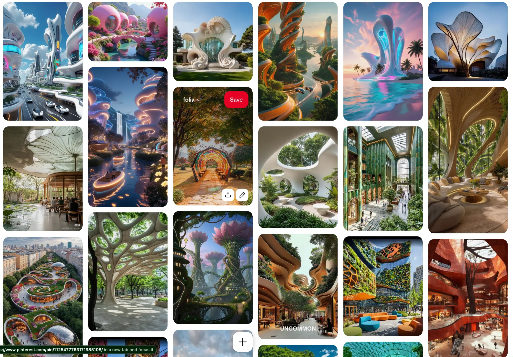
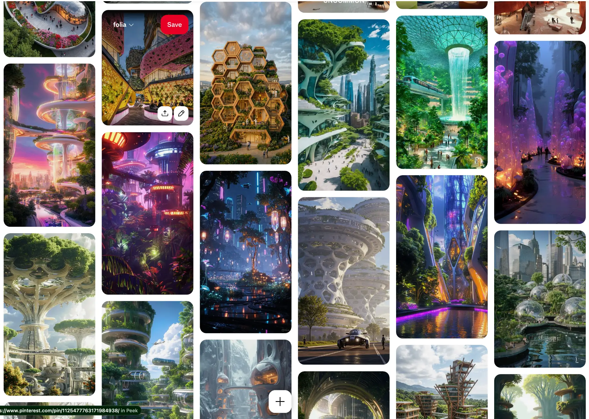
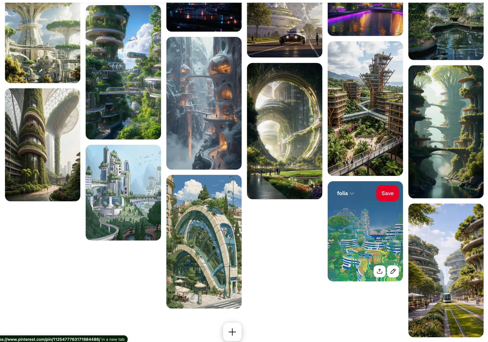

# Art Direction

The target is **"stylized-real" solarpunk**: clean forms, real materials, soft light and lush detail. It's futuristic and hopeful, never grimy, and **less toony than Monument Valley or Townscaper** (D-027, D-028 in [../decisions.md](../decisions.md)).

## References
The source is @bubbles' "folia" Pinterest board:

## Pillars
1. **Biomorphic architecture.** Flowing, stacked, curved terraces; seashell, petal and lotus forms; buildings that grow like trees, with branching columns and supertree canopies. Almost no right angles.
2. **Cellular lattices.** Voronoi and bone-like perforated canopies, honeycomb and hex modules, geodesic biodomes and glass arches. This is the structural vocabulary, and it should throw dappled shadows.
3. **Cream shells with warm gold, copper and terracotta curves.** Glossy white forms with warm ribbed accents, plus bold pops such as pink bubble homes and orange lounge seating.
4. **Greenery spilling off every level**: curated swirling rooftop flower gardens, wild vines and hanging plants, food-growing planters and allotments.
5. **Water as the stage**: canals, waterfalls (Jewel Changi), reflective pools and little boats with glowing rims.
6. **Night neon traces the architecture.** Light lines run along the curves, with lanterns and bioluminescent plants, reflected in water. It's not signage clutter.
7. **Connective tissue**: skybridges, monorails, trams on grass tracks and spiral walkways. Everything is interconnected.

## Palette
From the brand; `palette.ts` is the single source (D-024).
- **Structure:** gold and cream.
- **Bold paints:** tangerine `#F19E4B`, butter `#EFEA5D`, mint `#4BFED2`, lavender and hot pink.
- **Neon:** one signature color per neighborhood (Cortico = mint).
- **Nature:** forest-green base `rgb(0,30,23)`, with teal-to-lavender water at dusk.

## Fidelity by distance
- **Town view:** silhouette, color and light carry the read. Mid-LOD buildings and clustered foliage clumps.
- **Neighborhood vantage:** high-LOD hero geometry, dense planting and neon edge-lines. This is where the detail budget is spent.
- Voronoi canopies and curved terraces are generated procedurally in the Blender scripts. Surfaces are smooth-shaded with generous bevels, which is where gold highlights come alive (D-011). D-034 names the techniques.
- The mid LOD removes sub-pixel detail (bigger Voronoi cells, closed lattices, thicker neon), so the town view reads cleanly instead of shimmering (D-042).

## How the look is achieved
- **Golden hour:** foliage back-light translucency (D-045); gold and cream reflect an env scene with a warm sun glow and a dark-green ground (D-040); a per-keyframe warm grade and height fog (D-046).
- **Night:** neon always blooms, and baked `_NIGHT` spill, light-pool decals and a dim moon make it light the world, not just glow (D-038). The water shows neon reflection streaks (D-039).
- **Contact and depth:** AO is baked in placed context, so terraces, canopies and planters ground each other (D-031).
- Milestone 1 art-directs golden hour and night; dawn and midday come later (D-037).

## Cortico (Milestone 1)
An interconnected complex of buildings in varied sizes, each with its own function and all working together: housing, food growing, curated and wild greenery, and places to enjoy the outdoors. At the center is a **forum**, an upgraded solarpunk agora where people gather and talk. Everything is infused with a sort of magic, so even simple objects feel amplified. In the middle of the forum stand three pedestals holding a stylized laptop, a stylized smartphone and an audio glyph. The signature neon is mint (D-009).
